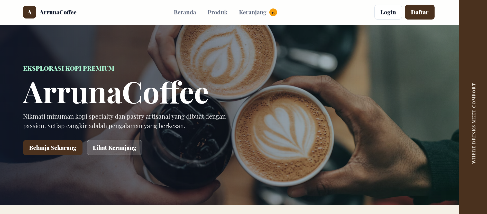

# Arunna Coffe

<p align="center">
  
</p>
Aplikasi e-commerce berbasis web untuk studi kasus UTS. Project ini dibuat dengan PHP native, MySQL/MariaDB, session cart, login user, checkout, simulasi pembayaran, dan dashboard admin CRUD produk.

## Fitur

- Homepage toko online
- Katalog produk dengan pencarian dan filter kategori
- Detail produk
- Keranjang belanja berbasis session
- Checkout dan penyimpanan pesanan
- Login dan registrasi user
- Dashboard admin untuk tambah, edit, hapus, dan melihat produk
- Simulasi pembayaran dummy
- Riwayat status pembayaran dan status pesanan

## Teknologi

- PHP 8+
- MySQL atau MariaDB
- HTML, CSS, dan JavaScript tanpa framework tambahan

## Cara Menjalankan

1. Aktifkan MySQL/MariaDB.
2. Import database:

```bash
mysql -u root -p < database/schema.sql
```

3. Jalankan server PHP dari root project:

```bash
php -S 127.0.0.1:8000 -t public
```

4. Buka aplikasi:

```text
http://127.0.0.1:8000
```

## Akun Admin Demo

```text
Email    : admin@kopinusa.test
Password : admin123
```

## Konfigurasi Database

Default koneksi ada di `config/database.php`.

```text
DB_HOST     127.0.0.1
DB_PORT     3306
DB_NAME     uja_ecommerce
DB_USER     root
DB_PASS     kosong
```

Jika perlu, nilai tersebut dapat diganti melalui environment variable `DB_HOST`, `DB_PORT`, `DB_SOCKET`, `DB_NAME`, `DB_USER`, dan `DB_PASS`.

## Struktur Project

```text
app/bootstrap.php          Helper koneksi database, session, auth, cart, format
config/database.php        Konfigurasi koneksi MySQL/MariaDB
database/schema.sql        Schema dan data awal
public/index.php           Halaman utama dan routing aplikasi
public/assets/css/style.css
public/assets/js/app.js
```

